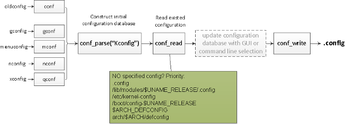

# Kconfig

`Kconfig` 是用来生成项目配置文件，也就是自动生成一些预定义的宏，最终生成的的配置文件是`.config`。`Linux`、`Buildroot` 、`Busybox` 和 `U-Boot` 等项目都是使用 `Kconfig` 来进行配置。

# Kconfig 基本用法

构建内核的第一步始终是配置。`Kconfig` 有助于使 `Linux` 内核高度模块化和可定制。`Kconfig` 为用户提供了许多配置目标（以 `Linux` 内核为例）：

| 配置目标        | 解释                                                          |
|-----------------|---------------------------------------------------------------|
| config          | 利用命令行程序更新当前配置                                    |
| nconfig         | 利用基于 `ncurses` 菜单的程序更新当前配置                     |
| `menuconfig`    | 利用基于菜单的程序更新当前配置                                |
| xconfig         | 利用基于 `Qt` 的前端程序更新当前配置                          |
| gconfig         | 利用基于 `GTK+` 的前端程序更新当前配置                        |
| oldconfig       | 基于提供的 `.config` 更新当前配置                             |
| localmodconfig  | 更新当前配置，禁用没有载入的模块                              |
| localyesconfig  | 更新当前配置，转换本地模块到核心                              |
| `defconfig`     | 带有来自架构提供的 `defconfig` 默认值的新配置                 |
| `savedefconfig` | 保存当前配置为 `./defconfig`（最小配置）                      |
| allnoconfig     | 所有选项回答为 `no` 的新配置                                  |
| allyesconfig    | 所有选项回答为 `yes` 的新配置                                 |
| allmodconfig    | 尽可能选择所有模块的新配置                                    |
| alldefconfig    | 所有符号（选项）设置为默认值的新配置                          |
| randconfig      | 所有选项随机选择的新配置                                      |
| listnewconfig   | 列出新选项                                                    |
| olddefconfig    | 同 `oldconfig` 一样，但设置新符号（选项）为其默认值而无须提问 |
| kvmconfig       | 启用支持 `KVM` 访客内核模块的附加选项                         |
| xenconfig       | 启用支持 `xen` 的 `dom0` 和 访客内核模块的附加选项            |
| tinyconfig      | 配置尽可能小的内核                                            |

这些目标中 `menuconfig` 是这些目标中最常用的。这些目标都是由不同的程序进行处理，这些程序由内核提供并在内核构建期间编译生成。与 `Kconfig` 相关工具和源代码主要位于内核源码中的 `scripts/kconfig/` 下。

从 `scripts/kconfig/Makefile` 中可以看到，这里有好几个程序，包含 `conf`、`mconf` 和 `nconf`。除了 `conf` 之外，每个都负责一个基于 `GUI` 的配置目标，因此 `conf` 处理大多数目标。

从逻辑上讲，`Kconfig` 的基础构成有两部分：一部分实现一种**新语言**来定义配置，另一部分用来解析 `Kconfig` 语言并处理配置操作。

大多数配置目标具有大致相同的处理过程（如下所示）：



# Kconfig 基本语法

## 基本数据类型

* `y`：选中该配置
* `n`：不选该配置
* `m`：以模块形式启用该配置，一般用于 `Linux` 驱动程序

| 类型       | 说明                               |
|------------|------------------------------------|
| `bool`     | `y/n`                              |
| `tristate` | `y/n/m`, 一般用于 `Linux` 驱动程序 |
| `string`   | 字符串                             |
| `hex`      | 十六进制数                         |
| `int`      | 整数                               |

## 基本命令

| 命令               | 说明                                                                                                                 |
|--------------------|----------------------------------------------------------------------------------------------------------------------|
| `mainmenu`         | 顶级菜单                                                                                                             |
| `config`           | 定义一个新的配置选项                                                                                                 |
| `menuconfig`       | 和 `config` 类似，但它在 `config` 的基础上要求所有的子选项作为独立的行显示                                           |
| `choice/endchoice` | 定义一组选项，只能选择其一                                                                                           |
| `comment`          | 定义了配置过程中显示给用户的注释，该注释还将写进输出文件, 可以使用 `depends on`                                      |
| `menu/endmenu`     | 定义一个菜单，所有依赖于此菜单的选项都是它的子选项， 可以使用 `depends on`                                           |
| `if/endif`         | 类似与 `C` 中的 `if` 条件判断， 支持与或非运算                                                                       |
| `source`           | 引入其他的 `Kconfig` 文件                                                                                            |
| `prompt`           | 提示信息，显示在 `make menuconfig` 中的名称，一般省略                                                                |
| `default`          | 默认值，一个配置可以有多个默认值，但是只有第一个被定义的值有效, 如果没有默认值的话，默认为不选中, 可以使用 `if` 判断 |
| `depends on`       | 依赖项，如果依赖的配置没有被选中，那么当前项也没有办法被选中 , 支持与或非运算                                        |
| `select`           | 反向依赖，如果当前选项被选中，那么 `select` 定义的选项也会被选中                                                     |
| `range`            | 定义一个数据范围，用于 `hex` 和 `interger`。`range A B`: 当前值不小于 `A`，不大于 `B`                                |
| `visible if`       | 决定 `menu` 是否显示，`depends on` 可有同样的功能                                                                    |
| `help`             | 帮助信息                                                                                                             |

# Kconfig 实例

## Demo 目录结构

``` shell
.
├── .config # 生成的配置文件
├── .config.old # 上一次的配置文件
├── demo.c
├── include
│   ├── config
│   │   ├── auto.conf # 生成 Makefile 使用的变量定义
│   │   ├── auto.conf.cmd
│   │   ├── kconfig
│   │   └── tristate.conf
│   └── generated
│       └── autoconf.h # 生成 C 语言使用的头文件，都是一些宏定义
├── Kconfig
├── main.c
├── Makefile
├── other-dir
│   └── Kconfig
└── scripts # Kconfig 工具
    ├── conf
    └── mconf

```

## 实例代码

[Kconfig Demo](https://github.com/ooops-t/Kconfig-demo.git)

# 参考链接

* <https://www.kernel.org/doc/html/latest/kbuild/kconfig-language.html>
* <https://linux.cn/article-11227-1.html>
* <https://www.caogenba.net/t-65138.html>
* <https://zhuanlan.zhihu.com/p/541265523>
* <https://www.cnblogs.com/fah936861121/p/7229522.html>
* <https://www.codenong.com/cs109393488/>
* <https://www.jianshu.com/p/aba588d380c2>
* <https://www.eet-china.com/mp/a123684.html>

